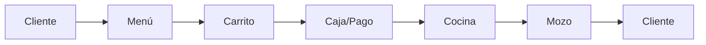

# 🍗 Sistema de Gestión para Pollería

Sistema completo de gestión para pollería con backend en Node.js y frontend en React.

## 📋 Características Principales

- **Gestión de Menú**: CRUD completo de productos
- **Sistema de Pedidos**: Flujo completo desde pedido hasta entrega
- **Módulo de Caja**: Procesamiento de pagos y generación de tickets
- **Panel de Cocina**: Gestión de comandas y preparación
- **Panel de Mozo**: Control de entregas y mesas
- **Autenticación JWT**: Sistema de roles y permisos
- **Base de Datos MySQL**: Almacenamiento persistente

## 🚀 Inicio Rápido

### Opción 1: Iniciar todo el sistema (Recomendado)
```bash
# En la carpeta raíz del proyecto
.\start-all.bat
```

### Opción 2: Iniciar por separado

**Backend:**
```bash
cd backend
npm install
npm start
```

**Frontend:**
```bash
cd frontend
npm install
npm run dev
```

## 🔗 URLs del Sistema

- **Frontend**: http://localhost:5173
- **Backend API**: http://localhost:8080
- **Health Check**: http://localhost:8080/health

## 👤 Usuarios de Prueba

| Usuario | Contraseña | Rol | Acceso |
|---------|------------|-----|--------|
| admin | admin123 | Administrador | Todo el sistema |
| caja | caja123 | Cajero | Menú, Caja |
| cocina | cocina123 | Cocinero | Cocina |
| mozo | mozo123 | Mozo | Menú, Mozo |

## 📁 Estructura del Proyecto

```
POLLAaSADA/
├── backend/
│   ├── src/
│   │   ├── config/         # Configuración de BD
│   │   ├── controllers/    # Controladores
│   │   ├── models/         # Modelos Sequelize
│   │   ├── routes/         # Rutas API
│   │   ├── middlewares/    # Middlewares
│   │   ├── app.js         # Configuración Express
│   │   └── server.js      # Servidor principal
│   ├── database/          # Scripts SQL
│   ├── .env              # Variables de entorno
│   └── package.json
│
├── frontend/
│   ├── src/
│   │   ├── components/    # Componentes React
│   │   ├── contexts/      # Context API
│   │   ├── pages/         # Páginas/Vistas
│   │   ├── services/      # Servicios API
│   │   ├── stores/        # Estado global (Zustand)
│   │   └── App.jsx       # Componente principal
│   ├── index.html
│   └── package.json
│
└── start-all.bat         # Script para iniciar todo
```

## 🔄 Flujo del Sistema



1. **Cliente** selecciona productos del menú
2. **Caja** procesa el pedido y genera ticket
3. **Cocina** prepara el pedido
4. **Mozo** entrega el pedido

## 🛠️ Tecnologías Utilizadas

### Backend
- Node.js + Express
- MySQL + Sequelize ORM
- JWT Authentication
- Bcrypt para encriptación
- CORS habilitado

### Frontend
- React 18 + Vite
- Tailwind CSS
- React Router v6
- Zustand (estado global)
- Axios (HTTP client)

## 📊 Base de Datos

### Configuración
```env
DB_HOST=172.80.15.84
DB_USER=polleria_puno
DB_PASSWORD=123456
DB_NAME=polleria_db
DB_PORT=3306
```

### Tablas Principales
- `Users` - Usuarios del sistema
- `Menus` - Productos del menú
- `Pedidos` - Órdenes de clientes
- `DetallePedidos` - Items de cada pedido
- `Pagos` - Registro de pagos
- `HistorialPedidos` - Trazabilidad de estados

## 🔒 Seguridad

- Autenticación JWT con expiración de 24h
- Contraseñas encriptadas con Bcrypt
- Sistema de roles y permisos
- Validación de datos en backend
- CORS configurado

## 📱 Características por Rol

### Administrador
- Acceso total al sistema
- Gestión de usuarios
- Configuración del menú
- Reportes y estadísticas

### Cajero
- Crear pedidos
- Procesar pagos
- Generar tickets
- Ver resumen de caja

### Cocinero
- Ver pedidos pendientes
- Marcar preparación iniciada
- Marcar pedidos como listos
- Estadísticas de cocina

### Mozo
- Ver pedidos listos
- Marcar como entregados
- Gestionar mesas
- Historial de entregas

## 🎯 Estados de Pedidos

```
pendiente → preparando → listo → entregado
                ↓
            cancelado
```

## 📈 Funcionalidades Destacadas

- ✅ Carrito de compras persistente
- ✅ Actualización en tiempo real (polling)
- ✅ Generación automática de tickets
- ✅ Historial completo de pedidos
- ✅ Estadísticas en tiempo real
- ✅ Interfaz responsiva
- ✅ Indicadores visuales de tiempo

## 🐛 Solución de Problemas

### El sistema no inicia
1. Verificar que Node.js esté instalado
2. Verificar conexión a base de datos MySQL
3. Revisar archivo .env en backend

### Error de conexión frontend-backend
1. Verificar que el backend esté corriendo en puerto 8080
2. Revisar configuración de proxy en vite.config.js
3. Verificar CORS en backend

### Base de datos no conecta
1. Verificar credenciales en .env
2. Verificar que MySQL esté activo
3. Verificar conectividad de red

## 📝 Comandos Útiles

```bash
# Backend
npm start          # Iniciar servidor
npm run dev        # Modo desarrollo

# Frontend
npm run dev        # Desarrollo
npm run build      # Compilar para producción
npm run preview    # Preview de producción
```

## 🚀 Despliegue

### Backend
1. Configurar variables de entorno de producción
2. Cambiar `NODE_ENV=production`
3. Usar PM2 o similar para gestión de procesos

### Frontend
1. Ejecutar `npm run build`
2. Servir carpeta `dist/` con servidor web
3. Configurar proxy reverso si es necesario

## 📄 API Documentation

La documentación completa de la API está disponible en:
- `backend/API_EXAMPLES.md` - Ejemplos de uso
- `backend/README.md` - Documentación técnica

## 🤝 Soporte

Para soporte o consultas sobre el sistema, revisar la documentación en cada carpeta o contactar al equipo de desarrollo.

## 📜 Licencia

Sistema propietario - Todos los derechos reservados

---

**Desarrollado con ❤️ para Pollería**
